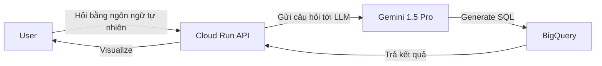
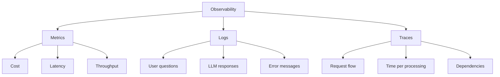
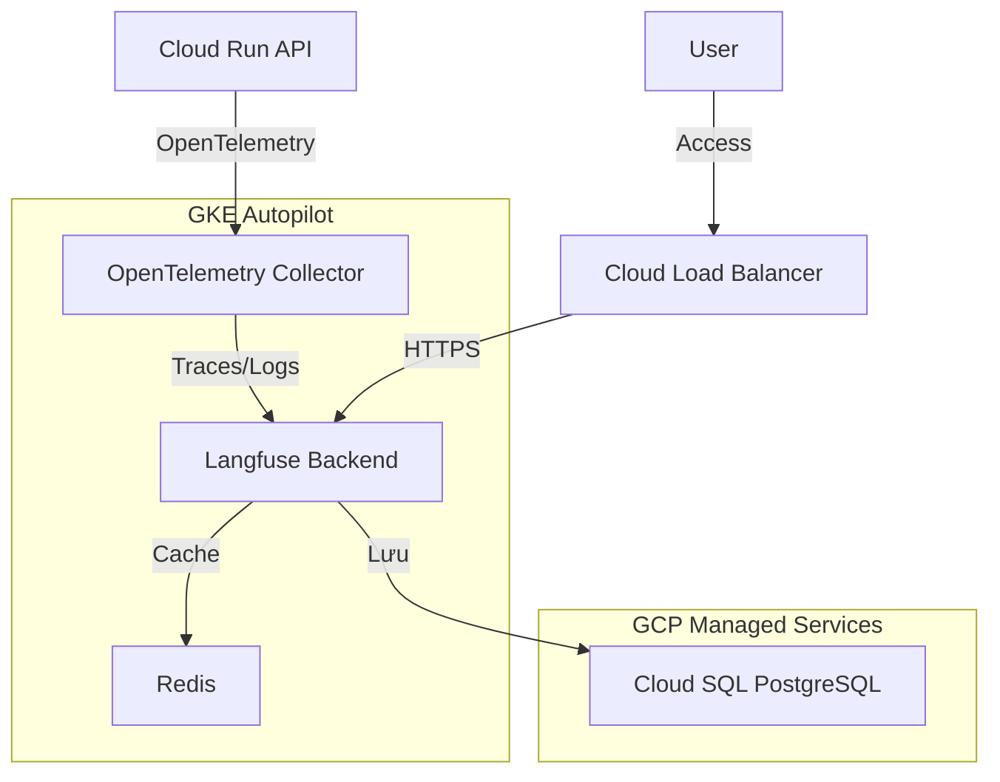

# Trải nghiệm Intern: Xây dựng LLM Ops/Observability với Langfuse

**Tác giả**: 広瀬エイトル (Heitor Hirose) - Sinh viên năm 2, Tokyo University of Technology  
**Thuộc**: CyberAgent AI事業本部  
**Thời gian intern**: 2 tháng (từ tháng 8/2025)  
**Ngày đăng**: 12 tháng 11, 2025  
**Nguồn**: [CyberAgent Developers Blog](https://developers.cyberagent.co.jp/blog/archives/59703/)

---

## Giới thiệu

Xin chào! Tôi là 広瀬エイトル (Heitor Hirose), đang intern tại CyberAgent AI事業本部.

Tôi là sinh viên năm 2 Tokyo University of Technology, tham gia internship 2 tháng từ tháng 8/2025.

Trong kỳ intern này, tôi thử thách với mission: **Xây dựng từ đầu LLM (Large Language Model) Observability infrastructure**. Cụ thể, tôi đã build **Langfuse** (một OSS tool) self-hosted trên GKE, tạo infrastructure để visualize cost, performance và logs của LLM.

Bài viết này sẽ chia sẻ:

1. **Product overview**: AI POS là gì
2. **LLM Observability là gì**: Tại sao cần
3. **Tool selection**: So sánh Langfuse, Arize Phoenix, LangSmith, Traceloop
4. **Architecture design**: GKE Autopilot + PostgreSQL + Redis + OpenTelemetry Collector
5. **Implementation details**: Build infrastructure bằng Terraform, GKE config
6. **Intern retrospective**: Những gì học được, khó khăn gặp phải

**Đối tượng:**
- Đang phát triển product với LLM
- Quan tâm đến xây dựng Observability infrastructure
- Quan tâm technical challenge trong internship
- Đang cân nhắc deploy Langfuse

Bắt đầu thôi!

---

## AI POS là gì

### Product overview

**AI POS** là AI tool phân tích POS data (Point of Sale data) của ngành retail và **trả lời câu hỏi bằng ngôn ngữ tự nhiên**.

**Vấn đề trước đây:**
- Phân tích POS data cần kiến thức chuyên môn về SQL hoặc BI tools
- Ngay cả câu hỏi đơn giản như "Top 10 sản phẩm bán chạy tháng trước?" cũng phải thao tác trực tiếp database
- Rào cản cao với non-technical users

**Giải pháp của AI POS:**
- Hỏi bằng ngôn ngữ tự nhiên (ví dụ: "Cho biết top 10 sản phẩm bán chạy tháng trước")
- LLM tự động generate SQL và thực thi query vào database
- Visualize kết quả dễ hiểu (graph, table...)

### Tech stack

- **Backend**: Cloud Run (Go)
- **Database**: BigQuery (lưu POS data)
- **LLM**: Gemini 1.5 Pro (generate Text to SQL)
- **Infrastructure**: GCP (Google Cloud Platform)

### System flow



**Ví dụ:**

**Câu hỏi**: "Cho biết top 10 sản phẩm bán chạy tháng trước"

**SQL do LLM generate:**
```sql
SELECT product_name, SUM(sales_amount) as total_sales
FROM pos_data
WHERE DATE_TRUNC(DATE(timestamp), MONTH) = DATE_TRUNC(CURRENT_DATE(), MONTH) - INTERVAL 1 MONTH
GROUP BY product_name
ORDER BY total_sales DESC
LIMIT 10;
```

**Kết quả**: Hiển thị list top 10 sản phẩm và graph

---

## LLM Observability là gì

### Định nghĩa

**LLM Observability** là việc visualize hoạt động của LLM để nắm được:

1. **Cost**: Chi phí mỗi API call (token count, price)
2. **Performance**: Response time, latency
3. **Quality**: Độ chính xác của text được generate, error rate
4. **Logs**: Câu hỏi của user, câu trả lời của LLM, intermediate processing

### Tại sao cần LLM Observability

Khi vận hành product với LLM, gặp những vấn đề sau:

| Vấn đề | Chi tiết | Giải quyết bằng Observability |
|--------|----------|------------------------------|
| **Cost không rõ** | LLM API call là pay-as-you-go. Có thể vượt budget... | Visualize token count, price realtime |
| **Nguyên nhân delay không rõ** | "Hơi chậm" nhưng không biết bottleneck ở đâu | Đo latency mỗi processing |
| **Tracking error khó** | Khi có error, logs phân tán không track được | Visualize chuỗi processing bằng distributed tracing |
| **Khó đánh giá quality** | LLM response đúng hay sai, đánh giá thế nào? | Record set prompt-response-evaluation |

### 3 trụ cột của Observability

Observability bao gồm 3 yếu tố:



**1. Metrics**
- Những gì đo được bằng số (cost, latency, throughput...)
- Visualize dưới dạng time-series data (graph, dashboard)

**2. Logs**
- Thông tin chi tiết về events (user questions, LLM responses, error messages...)
- Điều tra bằng text search, filtering

**3. Traces**
- Track chuỗi flow của request (distributed tracing)
- Xác định processing nào tốn thời gian

---

## Vấn đề hiện tại của product

AI POS hoạt động tốt, nhưng có những vấn đề về LLM Observability:

### Vấn đề 1: Cost không rõ

**Problem:**
- Không biết số lần LLM API call, token count
- Không nắm realtime "tháng này tốn bao nhiêu"
- GCP Billing dashboard là monthly summary nên không thấy cost trend hàng ngày

**Impact:**
- Khó quản lý budget
- Khó đưa ra biện pháp giảm cost

### Vấn đề 2: Performance bottleneck không rõ

**Problem:**
- Có report "response chậm" nhưng không biết chậm ở đâu
  - LLM API call?
  - BigQuery query execution?
  - Data visualization processing?

**Impact:**
- Không đặt được priority cho performance improvement

### Vấn đề 3: Tracking error khó

**Problem:**
- Error logs phân tán (Cloud Run, GCP Logging, LLM API)
- Khi có error, không link được user question, LLM response, error message

**Impact:**
- Debug tốn thời gian
- Khó reproduce

### Vấn đề 4: Không đánh giá được LLM quality

**Problem:**
- SQL do LLM generate đúng hay sai, chỉ có thể confirm thủ công
- Không đo được hiệu quả cải thiện prompt

**Impact:**
- Không chạy được PDCA cycle của prompt engineering

---

## Tool selection

Để build LLM Observability infrastructure, tôi so sánh 4 tools:

1. **Langfuse**
2. **Arize Phoenix**
3. **LangSmith**
4. **Traceloop**

### Comparison table

| Item | Langfuse | Arize Phoenix | LangSmith | Traceloop |
|------|---------|--------------|-----------|----------|
| **Self-Hosted** | ✅ Có thể | ✅ Có thể | ❌ Chỉ SaaS | ✅ Có thể |
| **OSS** | ✅ MIT License | ✅ Apache 2.0 | ❌ Proprietary | ✅ Apache 2.0 |
| **LangChain integration** | ✅ Xuất sắc | ✅ Xuất sắc | ✅ Native | ✅ Tốt |
| **OpenTelemetry support** | ✅ Có | ✅ Có | ❌ Không | ✅ Có |
| **UI** | Xuất sắc (intuitive) | Tốt | Xuất sắc | Đơn giản |
| **Dashboard** | Phong phú | Phong phú | Phong phú | Basic |
| **Cost visualization** | ✅ Chi tiết | ✅ Chi tiết | ✅ Chi tiết | ⚠️ Basic |
| **Prompt management** | ✅ Có | ❌ Không | ✅ Có | ❌ Không |
| **Evaluation** | ✅ Có | ✅ Có | ✅ Có | ❌ Không |
| **Alert** | ⚠️ Basic | ✅ Đầy đủ | ✅ Đầy đủ | ❌ Không |
| **Community** | Sôi nổi | Sôi nổi | Sôi nổi | Nhỏ |
| **Learning curve** | Thấp | Trung bình | Thấp | Thấp |

### Lý do chọn: Langfuse

Trong intern này, tôi chọn **Langfuse (Self-Hosted)**.

**Lý do:**

1. **Self-Hosted**: Không cần gửi data ra ngoài công ty
2. **Prompt management phong phú**: AI POS coi trọng prompt engineering
3. **UI/UX xuất sắc**: Toàn team dễ dùng
4. **OpenTelemetry support**: Dễ integrate với Observability infrastructure hiện có
5. **Community sôi nổi**: Docs đầy đủ, dễ giải quyết vấn đề

**Tại sao không chọn tools khác:**

- **Arize Phoenix**: Hỗ trợ general MLOps nhưng AI POS chỉ dùng LLM nên over-spec
- **LangSmith**: Không có Self-Hosted nên không đáp ứng security requirements
- **Traceloop**: Features basic, không có prompt management

---

## Architecture design

### Tổng quan

Build Langfuse Self-Hosted infrastructure trên GKE (Google Kubernetes Engine).



### Component structure

#### 1. GKE Autopilot

**Lý do chọn:**
- Không cần quản lý node (Google tự động scaling)
- Security patch tự động apply
- Cost optimization (chỉ charge phần dùng)

**Config:**
- Region: `asia-northeast1` (Tokyo)
- Release channel: `REGULAR`
- Network: VPC + Private Subnet

#### 2. Cloud SQL for PostgreSQL

**Lý do chọn:**
- Langfuse dùng PostgreSQL để lưu data
- Fully managed, tự động backup và scaling

**Config:**
- Version: PostgreSQL 15
- Instance type: `db-n1-standard-2` (2 vCPU, 7.5GB memory)
- Storage: 100GB (SSD, auto-resize enabled)
- Backup: Auto daily backup (retention 7 days)

#### 3. Redis (Pod trong GKE)

**Lý do chọn:**
- Langfuse dùng Redis cho cache
- Sử dụng cho session management, rate limiting...

**Config:**
- Image: `redis:7-alpine`
- Memory: 512MB
- Persistence: Không (chỉ cache)

#### 4. OpenTelemetry Collector (Cloud Run sidecar)

**Lý do chọn:**
- Relay point gửi data từ Cloud Run API tới Langfuse
- Collect traces, logs tập trung và forward tới Langfuse

**Config:**
- Deploy: Cloud Run sidecar container
- Receive: OTLP/gRPC (từ Cloud Run API)
- Send: OTLP/HTTP (tới Langfuse)

**Cloud Run sidecar:**
- Deploy đồng thời main container (API) và sidecar container (OpenTelemetry Collector) trong 1 Cloud Run service
- Main container access sidecar qua `localhost`
- Ưu điểm: Network latency tối thiểu, deploy đơn giản

---

## Implementation details

### 1. Build infrastructure bằng Terraform

**Directory structure:**
```
terraform/
├── main.tf
├── variables.tf
├── outputs.tf
├── modules/
│   ├── gke/
│   ├── cloud-sql/
│   └── vpc/
```

**Main configs:**

**GKE Autopilot:**
```hcl
resource "google_container_cluster" "primary" {
  name     = "langfuse-cluster"
  location = var.region
  
  enable_autopilot = true
  
  release_channel {
    channel = "REGULAR"
  }
  
  network    = google_compute_network.vpc.name
  subnetwork = google_compute_subnetwork.subnet.name
  
  private_cluster_config {
    enable_private_nodes    = true
    enable_private_endpoint = false
    master_ipv4_cidr_block  = "172.16.0.0/28"
  }
}
```

### 2. Langfuse trên GKE

**Kubernetes Manifest:**

```yaml
apiVersion: apps/v1
kind: Deployment
metadata:
  name: langfuse
  namespace: langfuse
spec:
  replicas: 2
  selector:
    matchLabels:
      app: langfuse
  template:
    metadata:
      labels:
        app: langfuse
    spec:
      containers:
      - name: langfuse
        image: langfuse/langfuse:latest
        ports:
        - containerPort: 3000
        env:
        - name: DATABASE_URL
          valueFrom:
            secretKeyRef:
              name: langfuse-secrets
              key: DATABASE_URL
        resources:
          requests:
            cpu: "500m"
            memory: "1Gi"
          limits:
            cpu: "2000m"
            memory: "4Gi"
```

### 3. Những điểm khó khăn

#### 1. Learning curve của Terraform và GKE

**Problem:**
- Lần đầu dùng Terraform, mất thời gian làm quen HCL syntax
- GKE có nhiều config items, không biết nên set cái nào

**Giải quyết:**
- Đọc official docs, sample code của Terraform
- Tham khảo mentor để narrow down configs cần thiết

#### 2. Connect tới Cloud SQL

**Problem:**
- Connect từ GKE tới Cloud SQL (Private IP) không được
- Error message: `connection refused`

**Nguyên nhân:**
- Thiếu Cloud SQL Proxy hoặc Workload Identity config
- VPC firewall rules chưa đúng

**Giải quyết:**
- Thêm Cloud SQL Proxy làm sidecar
- Review VPC firewall rules, cho phép GKE → Cloud SQL

---

## Intern retrospective

### Những gì học được

#### 1. Infrastructure building skills

- **Terraform**: Tư duy IaC, modularization, state management
- **GKE**: Kubernetes basics, đặc điểm GKE Autopilot, network design
- **GCP**: Cloud SQL, VPC, Firewall, IAM setup

#### 2. Tầm quan trọng của Observability

- **LLM Observability**: Giá trị của việc visualize cost, performance, quality
- **OpenTelemetry**: Cách build standard Observability infrastructure

#### 3. Problem solving ability

- **Error isolation**: Khả năng xác định nguyên nhân từ logs, error messages
- **Document reading**: Khả năng thu thập thông tin từ official docs, GitHub issues

---

## Tổng kết

### Thành quả của intern

Trong kỳ intern này, tôi đã **xây dựng từ đầu LLM Ops/Observability infrastructure**.

**Những gì build:**
- Langfuse Self-Hosted infrastructure (GKE Autopilot + Cloud SQL + Redis)
- OpenTelemetry Collector (Cloud Run sidecar)
- Infra as Code bằng Terraform

**Những gì đạt được:**
- Visualize realtime cost, performance, logs của LLM
- Prompt version control, A/B testing
- Error trace tracking

### Tại sao chọn Langfuse đúng đắn

1. **Self-Hosted**: Không cần gửi data ra ngoài
2. **UI/UX xuất sắc**: Intuitive, toàn team dễ dùng
3. **Prompt management phong phú**: Tăng hiệu quả prompt engineering
4. **OpenTelemetry support**: Dễ integrate với standard Observability infrastructure

### Trưởng thành qua intern

- **Infrastructure skills**: Học được Terraform, GKE, GCP
- **Hiểu Observability**: Cảm nhận tầm quan trọng của Metrics, Logs, Traces
- **Problem solving**: Cải thiện khả năng error isolation, đọc docs

### Hướng đi tiếp theo

Từ Langfuse infrastructure đã build, muốn realize:

- Implement alert features
- Strengthen evaluation features
- Deploy sang các products khác

Qua kỳ intern này, tôi học được sự sâu sắc của product development với LLM và tầm quan trọng của Observability. Tôi muốn tiếp tục đóng góp trong lĩnh vực LLM Ops/Observability.

---

## Tài liệu tham khảo

### Langfuse
- [Langfuse Official](https://langfuse.com/)
- [Langfuse GitHub](https://github.com/langfuse/langfuse)

### OpenTelemetry
- [OpenTelemetry Official](https://opentelemetry.io/)
- [OpenTelemetry Collector](https://opentelemetry.io/docs/collector/)

### GCP
- [GKE Autopilot](https://cloud.google.com/kubernetes-engine/docs/concepts/autopilot-overview)
- [Cloud SQL for PostgreSQL](https://cloud.google.com/sql/docs/postgres)

---

## Kết luận

Cảm ơn bạn đã đọc đến cuối!

Qua kỳ intern này, tôi có trải nghiệm rất quý giá là xây dựng LLM Ops/Observability infrastructure.

Langfuse là tool rất mạnh khi vận hành product với LLM. Hy vọng bài viết này hữu ích cho những ai quan tâm đến LLM Observability.

Nếu có câu hỏi hoặc feedback, đừng ngần ngại comment hoặc liên hệ qua Twitter!

---

**Tags**: #インターン #LLM #Langfuse #Observability #GCP #OpenTelemetry #AI_POS
